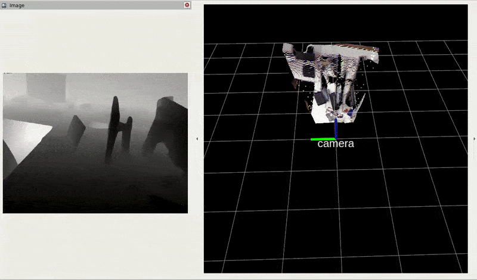
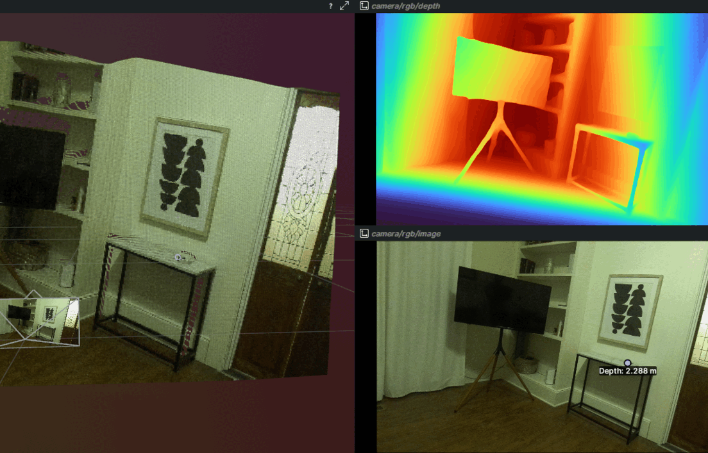
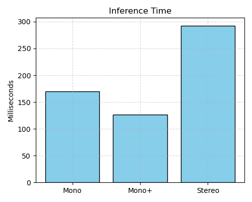
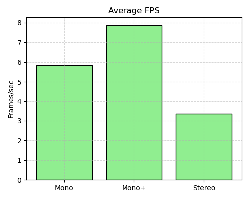

<div align="center">

# SpatialFusion-LM: Foundational Vision Meets SpatialLM

</div>

<div align="justify">

SpatialFusion-LM is a unified framework for spatial 3D scene understanding from monocular or stereo RGB input. It integrates depth estimation, differentiable 3D reconstruction, and spatial layout prediction using large language models.

</div>

<p align="center">
  <table style="width: 100%;">
    <tr>
      <td align="center" style="width: 50%;">
        <br/>
        <em>Replica scene <code>office3</code></em>
      </td>
      <td align="center" style="width: 50%;">
        <br/>
        <em>TUM scene <code>office</code></em>
      </td>
    </tr>
  </table>
</p>

## 🖥️ Tested Configuration
SpatialFusion-LM has been tested on:

- 🐧 **Ubuntu:** 24.04  
- 🧠 **GPU:** NVIDIA RTX A6000  
- ⚙️ **CUDA:** 12.8  
- 🧊 **Environment:** Docker container with GPU support

> Other modern Ubuntu + CUDA setups may work, but this is the validated reference configuration.

> A GPU with ≥ 24 GB of VRAM is recommended to ensure stable real-time inference and efficient handling of high-resolution inputs across all components.


## 🚀 Quick Start

1. Clone the repo

```shell
git clone --recursive https://github.com/jagennath-hari/SpatialFusion-LM.git && cd SpatialFusion-LM
```

2. Download model weights and sample dataset

```shell
bash scripts/download_weights.sh && bash scripts/download_sample.sh
```

3. Run the demo inside Docker
```shell
bash run_container.sh
ros2 launch llm_ros llm_demo.launch.py
```

> Change modes using mode:=mono/mono+/stereo

## 🎮 Supported Modes

|   Mode   |  Input   |       Depth Estimator               |       Use Case        |
|:-------------|:-------:|:---------------------------------------------------------------------------:|---------------------:|
| `mono`       | RGB Only  | UniK3D (ViT-L)     | Uncalibrated monocular          |
| `mono+`  | RGB + camera intrinsics    | UniK3D (ViT-L)   | Calibrated monocular              |
| `stereo`      | Rectified left + right + intrinsics + baseline    | FoundationStereo (ViT-S)              | Accurate stereo depth        |

## 📖 Overview

<div align="justify">

SpatialFusion-LM is a unified framework for spatially grounded 3D scene understanding from monocular or stereo RGB input. It integrates learning-based depth estimation, differentiable point cloud reconstruction, and spatial language modeling into a modular ROS 2 pipeline. By combining geometric cues with linguistic priors, the system generates object-centric 3D layouts that support semantic reasoning, embodied navigation, and robot perception in real-world environments.

The architecture decouples 3D scene inference into three core stages: (1) neural depth prediction, (2) back-projection and point cloud generation, and (3) spatial layout prediction via large-scale language models trained for 3D relational reasoning. Notably, the spatial reasoning is performed over instantaneous point clouds reconstructed in the local camera frame, rather than accumulated global maps, enabling frame-wise layout estimation in dynamic or unstructured environments.

SpatialFusion-LM supports real-time inference, dataset extensibility, and structured logging through Rerun and ROS2, making it suitable for research in vision-language grounding, scene reconstruction, and robotics.

</div>

## 🔧 Features

- 📷 Supports monocular, monocular+ and stereo vision
- 🔍 Neural depth estimation with metric 3D reconstruction
- 🧱 Differentiable point cloud generation in the camera frame
- 🧠 Language-conditioned spatial layout prediction
- 🧩 Modular ROS2 architecture (plug-and-play components)
- 🌀 Real-time inference and visualization
- 📊 Integrated logging via [**Rerun**](https://www.rerun.io/)

## ✅ TODO

- [ ] Create end-to-end inference using [**Triton Inference Server**](https://github.com/triton-inference-server) via ensemble models
- [ ] Quantize [**UniK3D**](https://lpiccinelli-eth.github.io/pub/unik3d/) and [**FoundationStereo**](https://nvlabs.github.io/FoundationStereo/) to [**TensorRT**](https://github.com/NVIDIA/TensorRT) engines
- [ ] Fix [**UniK3D**](https://lpiccinelli-eth.github.io/pub/unik3d/) CUDA Memeory stream for async error while running [**SpatialLM**](https://manycore-research.github.io/SpatialLM/) in parallel
- [x] **(2025-04-24)** Expand evaluation to TUM, Replica, and with one custom recorded dataset

## 🗃️ Download TUM and Replica ROS2 datasets

This script will prompt you to select one or more datasets to download:

```shell
bash scripts/download_dataset.sh
```

## ⚙️ Launch Configuration Options

The `llm_demo.launch.py` file accepts the following arguments:

|   Argument   |  Type   |                               Description                                   |       Default        |
|:-------------|:-------:|:---------------------------------------------------------------------------:|---------------------:|
| `mode`       | string  | Input mode: `mono`, `mono+`, or `stereo`                                    | `stereo`             |
| `spatialLM`  | bool    | Enable or disable layout prediction via SpatialLM                           | `true`               |
| `rerun`      | bool    | Enable or disable logging to [**Rerun**](https://rerun.io)                      | `true`               |
| `rviz`       | bool    | Enable or disable RVIZ visualization                                        | `true`               |
| `bag_path`   | string  | Path to the ROS2 bag file (e.g., `/datasets/indoor_0`)                      | `/datasets/indoor_0` |

### 📸 Mono, 📷 Mono+, 📷 📷 Stereo?

<p align="center">
<pre>
+---------------------------------+
|              mode=?             |
+---------------------------------+
                |
  ┌─────────────┴──────────────┐
  │             │              │
  mono          mono+        stereo
  │             │              │
  rgb          rgb           camera
               intr.          intr.
                +              +
               rgb           stereo
                              pair
                                +
                             baseline
</pre>
</p>

#### 🤖 Mode Descriptions

* **`mono`** – Only RGB image is provided.  
  [**UniK3D**](https://lpiccinelli-eth.github.io/pub/unik3d/) internally estimates camera intrinsics and uses them to predict **metric (absolute) depth**.  
  While this enables 3D reconstruction without calibration, the accuracy depends on the quality of intrinsic estimation.  
  🚀 Suitable for quick deployment or uncalibrated cameras.

* **`mono+`** – RGB image **and** accurate camera intrinsics are provided.  
  [**UniK3D**](https://lpiccinelli-eth.github.io/pub/unik3d/) uses the supplied intrinsics to produce **more accurate metric depth**, with better scale alignment.  
  🧪 Ideal for calibrated cameras (e.g., using `/camera_info`).

* **`stereo`** – Left and right **rectified images**, intrinsics, and baseline are required.  
  [**FoundationStereo**](https://nvlabs.github.io/FoundationStereo/) uses a ViT-based architecture to predict **dense disparity maps** from stereo pairs.  
  Metric depth is then computed using the stereo baseline and intrinsics, and converted to a 3D point cloud.  
  🛡️ This mode provides the most **robust and accurate** depth, especially in structured or texture-rich environments.

## 🖼️ Demo Gallery

Below are example configurations showing how SpatialFusion-LM behaves with different launch options. 

---

### 📸 Mono 🧠 SpatialLM Disabled (mono, rerun)

```shell
ros2 launch llm_ros llm_demo.launch.py mode:=mono spatialLM:=false rerun:=true rviz:=false
```

<p align="center">
  <br/>
  <em>SpatialFusion-LM performing monocular estimation and 3D reconstruction on TUM scene <code>xyz</code>.</em>
</p>

### 📷 📷 Stereo 🧠 SpatialLM Disabled (mono, rerun)

```shell
ros2 launch llm_ros llm_demo.launch.py mode:=stereo spatialLM:=false rerun:=true rviz:=false
```

<p align="center">
  <br/>
  <em>SpatialFusion-LM performing stereo estimation and 3D reconstruction on indoor scene <code>indoor_0</code>.</em>
</p>

### 🧪 Run with TUM Dataset

SpatialFusion-LM supports pre-recorded ROS2 bags from the TUM RGB-D dataset. The `llm_demo_tum.launch.py` launch file is preconfigured and `mono` or `mono+` modes depending on intrinsics.

```shell
ros2 launch llm_ros llm_demo_tum.launch.py \
  mode:=mono+ \
  bag_path:=/datasets/tum_office \
  spatialLM:=true \
  rerun:=true \
  rviz:=true
```
>  This assumes you have already downloaded the ROS2 TUM dataset. If not, you can follow the provided script `scripts/download_dataset.sh` to do this.

<p align="center">
  <br/>
  <em>SpatialFusion-LM performing monocular+ estimation, 3D reconstruction, and spatial layout prediction on TUM scene <code>office</code>.</em>
</p>


<p align="center">
  <br/>
  <em>SpatialFusion-LM performing monocular estimation and 3D reconstruction on TUM scene <code>desk</code>.</em>
</p>

### 🧪 Run with Replica Dataset

SpatialFusion-LM supports pre-recorded ROS2 bags from the Replica dataset. The `llm_demo_replica.launch.py` launch file is preconfigured and `mono` or `mono+` modes depending on intrinsics.

```shell
ros2 launch llm_ros llm_demo_replica.launch.py \
  mode:=mono+ \
  bag_path:=/datasets/replica_office2 \
  spatialLM:=true \
  rerun:=true \
  rviz:=true
```
>  This assumes you have already downloaded the ROS2 Replica dataset. If not, you can follow the provided script `scripts/download_dataset.sh` to do this.

<p align="center">
  <br/>
  <em>SpatialFusion-LM performing monocular+ estimation, 3D reconstruction, and spatial layout prediction on Replica scene <code>office2</code>.</em>
</p>


<p align="center">
  <br/>
  <em>SpatialFusion-LM performing monocular estimation and 3D reconstruction on Replica scene <code>room0</code>.</em>
</p>

## 🛠️ Using SpatialFusion-LM with Your Own ROS2 Topics

To run SpatialFusion-LM on a live ROS2 system or your own dataset:

### 1️⃣ Use `llm.launch.py` for direct topic-level control

This version of the launch file allows you to specify **raw topic names directly** (no bag playback or auto setup). Examples:

#### This simulates mode:=mono as there is no rgb_info provided.
```shell
ros2 launch llm_ros llm.launch.py \
  rgb_image:=/your_camera/image_rect \
  rerun:=true \
  spatialLM:=true
```

#### This simulates mode:=mono+ as rgb_info is provided.
```shell
ros2 launch llm_ros llm.launch.py \
  rgb_image:=/your_camera/image_rect \
  rgb_info:=/your_camera/camera_info \
  rerun:=true \
  spatialLM:=true
```

#### This simulates mode:=stereo as left and right topics, left_info and right_info, and baseline are provided.
```shell
ros2 launch llm_ros llm.launch.py \
  left_image:=/stereo/left/image_rect \
  right_image:=/stereo/right/image_rect \
  left_info:=/stereo/left/camera_info \
  right_info:=/stereo/right/camera_info \
  baseline:=0.12 \
  rerun:=true \
  spatialLM:=true
```

### 2️⃣ Parameter Descriptions
```shell
ros2 launch llm_ros llm.launch.py -s
```
|Parameter | Description | Default | ROS Msg Type |
|:----------|:-----------:|:-------:|--------------:|
|`rgb_image` | RGB image topic | '' | `sensor_msgs/msg/Image` |
|`rgb_info` | RGB camera info topic | '' | `sensor_msgs/msg/CameraInfo` |
|`left_image` | Left stereo image topic | '' | `sensor_msgs/msg/Image` |
|`right_image` | Right stereo image topic | '' | `sensor_msgs/msg/Image` |
|`left_info` | Left camera info topic | '' | `sensor_msgs/msg/CameraInfo` |
|`right_info` | Right camera info topic | '' | `sensor_msgs/msg/CameraInfo` |
|`baseline` | Stereo camera baseline (in meters) | `0.0` | `float` (launch param) |
|`rerun` | Enable Rerun logging | `true` | `bool` (launch param) |
|`spatialLM` | Enable 3D layout prediction via SpatialLM | `true` | `bool` (launch param) |


### 📤 Output Topics

These are the outputs published by the core_node.py:

|Topic|Description|ROS Msg Type|
|:----|:---------:|-----------:|
|`/spatialLM/depth`|	Predicted depth map (1-channel float)|	`sensor_msgs/msg/Image`|
|`/spatialLM/cloud`|	Reconstructed 3D point cloud|	`sensor_msgs/msg/PointCloud2`|
|`/spatialLM/image`|	RGB image with projected 3D layout|	`sensor_msgs/msg/Image`|
|`/spatialLM/boxes`|	Predicted 3D layout objects (e.g., boxes)|	`visualization_msgs/msg/MarkerArray`|
|`/tf`|	Transform tree| (e.g., map → camera)|	`tf2_msgs/msg/TFMessage`|

## ⚖️ Depth Comparison

<p align="center">
  <br/>
  <em>Comparison of predicted depth maps from <code>stereo</code>, <code>mono+</code>, and <code>mono</code> modes respectively.</em>
</p>

## 📈 Performance Benchmarks

Measured on a single NVIDIA RTX A6000 (48 GB VRAM) at 1920×1080 resolution.
Input images are automatically resized to model-specific inference resolution, and values may vary depending on hardware, backend load, and ROS2 message overhead.

> Measured using Headless mode without Rerun or RVIZ.

<p align="center">
  
  
  
</p>

| Mode    | Inference Time (ms) | Avg FPS | VRAM Used | Backbone |
|:-------:|:-------------------:|:-------:|:---------:|:--------:|
| Mono    | 169.6               | 5.85    | 4440 MiB  | UniK3D (ViT-L) |
| Mono+   | 126.1               | 7.87    | 4460 MiB  | UniK3D (ViT-L) |
| Stereo  | 292.5               | 3.35    | 2126 MiB  | FoundationStereo (ViT-S) |

## 🤝 Contributing

I welcome pull requests and suggestions! If you want to add a new dataset, model backend, or visualization utility, open an issue or fork this repo!

If you find any bug in the code, please report to jh7454@nyu.edu

## 📖 Citation
If you found this code/work to be useful in your own research, please considering citing the following:
```bibtex
@article{wen2025stereo,
  title={FoundationStereo: Zero-Shot Stereo Matching},
  author={Bowen Wen and Matthew Trepte and Joseph Aribido and Jan Kautz and Orazio Gallo and Stan Birchfield},
  journal={CVPR},
  year={2025}
}
```
```bibtex
@inproceedings{piccinelli2025unik3d,
    title     = {{U}ni{K3D}: Universal Camera Monocular 3D Estimation},
    author    = {Piccinelli, Luigi and Sakaridis, Christos and Segu, Mattia and Yang, Yung-Hsu and Li, Siyuan and Abbeloos, Wim and Van Gool, Luc},
    booktitle = {IEEE/CVF Conference on Computer Vision and Pattern Recognition (CVPR)},
    year      = {2025}
}
```
```bibtex
@misc{spatiallm,
  title        = {SpatialLM: Large Language Model for Spatial Understanding},
  author       = {ManyCore Research Team},
  howpublished = {\url{https://github.com/manycore-research/SpatialLM}},
  year         = {2025}
}
```

## 📄 License
This software is released under the [GNU General Public License v3.0 (GPL-3.0)](LICENSE). You are free to use, modify, and distribute this code under the terms of the license, but **derivative works must also be open-sourced** under GPL-3.0.

## 🙏 Acknowledgement
This work integrates several powerful research papers, libraries, and open-source tools:

- [**FoundationStereo**](https://nvlabs.github.io/FoundationStereo/)
- [**UniK3D**](https://lpiccinelli-eth.github.io/pub/unik3d/)
- [**SpatialLM**](https://manycore-research.github.io/SpatialLM/)
- [**Rerun**](https://rerun.io) 